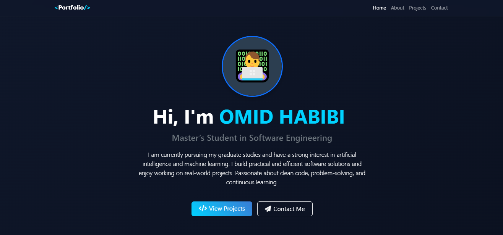
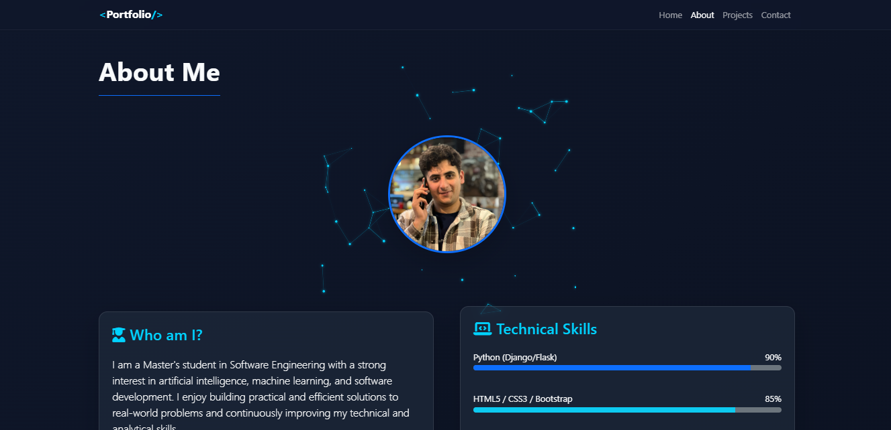
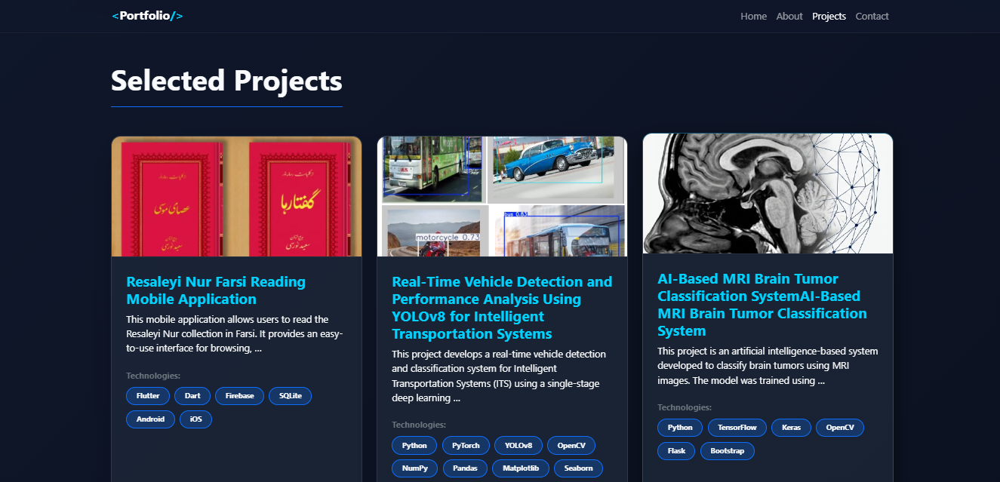
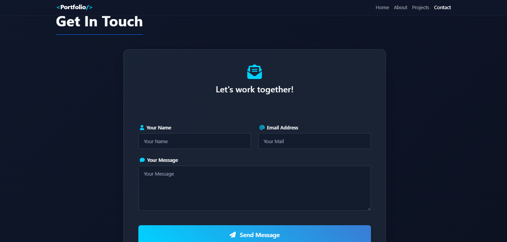

# 🌐 Personal Portfolio Website

This is my personal portfolio website built with **Django**.
The website showcases my projects, information about me, and ways to contact me.

---

## 🚀 Features

* Personal portfolio homepage
* About section with personal information
* Projects section to display my work
* Contact section for communication
* Media uploads support
* Clean and responsive design

---
### 🏠 Home


### 👨‍💻 About


### 📂 Projects


### 📞 Contact

---

## 🛠️ Technologies Used

* Python
* Django
* HTML
* CSS
* JavaScript
* SQLite

---

## ⚙️ Installation

### 1️⃣ Clone the repository

```
git clone https://github.com/omidhabib/portfolio.git
cd portfolio
```

### 2️⃣ Create virtual environment

```
python -m venv venv
```

Activate the environment:

Windows

```
venv\Scripts\activate
```

Mac/Linux

```
source venv/bin/activate
```

### 3️⃣ Install dependencies

```
pip install -r requirements.txt
```

### 4️⃣ Run database migrations

```
python manage.py migrate
```

### 5️⃣ Start the development server

```
python manage.py runserver
```

Open your browser and go to:

```
http://127.0.0.1:8000/
```

---

## 📁 Project Structure

```
portfolio/
│
├── core/                 # Main application
├── templates/            # HTML templates
├── static/               # CSS, JS, Images
├── media/                # Uploaded media files
├── screenshots/          # Website screenshots
│
├── manage.py
├── db.sqlite3
└── README.md
```

---

## 📬 Contact

If you would like to get in touch, you can reach me through the contact section of the website.

---

## 👤 Author

**Omid Habibi**

GitHub:
https://github.com/omidhabib

---

## ⭐ Support

If you like this project, please consider giving it a ⭐ on GitHub.
